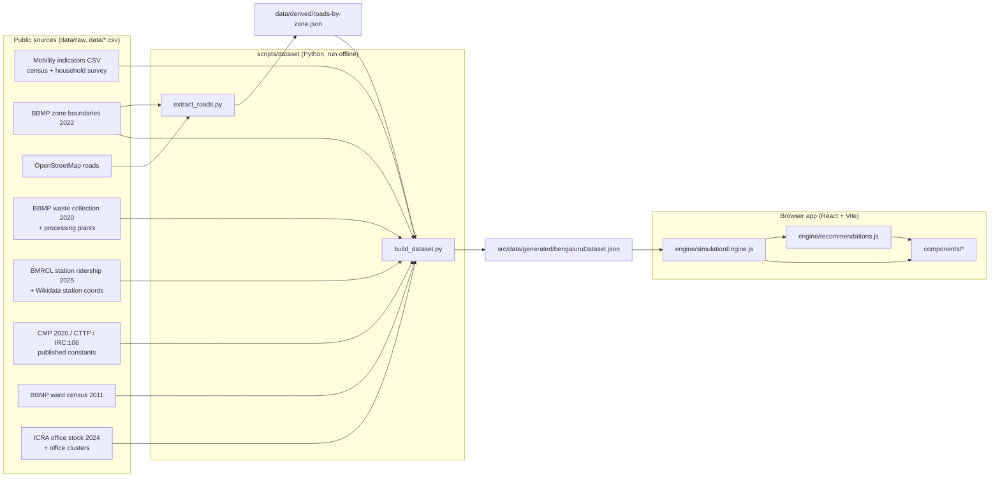

# CityFlow Architecture

CityFlow is a what-if simulator for peak-hour urban pressure in Bengaluru. You change private-vehicle
use, work from home, bus and metro service, freight volume and timing, waste processing, or close a
major road, and it shows how traffic, freight logistics and solid-waste handling respond in each of
the 8 BBMP zones, and what it would take to fix what breaks.

It is a static single-page app: there is no server and no live feed. A Python pipeline turns public
datasets into one JSON file, and a pure JavaScript engine runs the model in the browser.



## Running it

| Command | What it does |
|---|---|
| `npm install && npm run dev` | Start the app at http://localhost:5173 |
| `npm run validate` | Engine checks: calibration, trip conservation, direction of effects, closures |
| `npm run build` | Production bundle in `dist/` |
| `npm run build:data` | Rebuild the dataset JSON from `data/` (needs Python 3 + `pip install -r scripts/dataset/requirements.txt`) |
| `npm run fetch:data` | Re-download every raw source into `data/raw/` |

`build:data` works from a fresh clone because the processed road network
(`data/derived/roads-by-zone.json`) is committed. The raw OpenStreetMap tiles (~75 MB) are gitignored,
so `extract_roads.py` only needs to run again after `fetch:data`.

## Repository layout

```
data/
  bengaluru-mobility-indicators.csv   zone growth, jobs, trip rate, trip length, mode share
  office-clusters.csv                 Grade-A office clusters (stock split, location)
  raw/                                downloaded sources (OSM tiles gitignored)
  derived/roads-by-zone.json          lane-km and capacity per zone and per corridor
scripts/
  dataset/                            fetch_raw.sh, extract_roads.py, build_dataset.py, zones.py
  validateEngine.js                   engine validation (npm run validate)
src/
  data/generated/bengaluruDataset.json   the dataset (generated; do not hand-edit)
  data/cityData.js                    single import point for the dataset
  data/presetScenarios.js             preset what-if scenarios
  engine/simulationEngine.js          the model (pure functions, no React)
  engine/recommendations.js           solver-based advice: smallest lever change that fixes each problem
  utils/scenarioUrl.js                scenario <-> shareable URL
  components/                         UI panels
  utils/formatters.js                 number formatting and severity thresholds
```

## Data sources

Every figure in the zone inspector carries a tag: **Measured** means taken directly from a source,
**Derived** means arithmetic on measured inputs, and **Estimated** means it depends on at least one assumption below.

| Input | Source | Year | Status |
|---|---|---|---|
| Zone boundaries (8 zones) | [BBMP Zone Boundaries, OpenCity](https://data.opencity.in/dataset/bbmp-ward-information) | 2022 | Measured |
| Zone population | [BBMP ward-wise data, OpenCity](https://data.opencity.in/dataset/e40ab411-c575-4c90-8bde-31bcb8df575f): 198 wards summed by zone | 2011 census | Measured (total 84,43,675) |
| Population growth, jobs, trip rate, mode share | `data/bengaluru-mobility-indicators.csv` | 2001–2011 census, 2008-era survey | Measured |
| Grade-A office stock (263 msf), occupancy (88.6%), 86% in NE + SE | [ICRA, Office – Bengaluru](https://www.icra.in/Rating/DownloadResearchSummaryReport/6188) | Dec 2024 | Measured |
| Office stock growth (7.5% a year, 2013–2024) | Industry office-market reports | 2024 | Measured |
| Office stock by cluster | `data/office-clusters.csv` | 2024 | Estimated within ICRA's regional totals |
| Motorised trip length (2W 9.8, car 10.2, taxi 13.1 km) | CMP 2020, via [ADB/ATO State of Play](https://asiantransportobservatory.org/documents/337/Bangalore_urban_state_of_play.pdf) | 2020 | Measured, used for calibration |
| Road length, class and lanes | OpenStreetMap via Overpass | 2026 | Measured (lanes tagged on 62–99% of arterial km; class defaults elsewhere) |
| Per-lane road capacity | IRC:106-1990 capacity guidelines | 1990 | Published standard |
| Vehicle occupancy (car 2.3, 2W 1.5, auto 1.8, bus 37.5) | CMP 2020 household survey | 2020 | Measured |
| BMTC fleet operated (6,143) | CMP 2020 Table 2-7 | 2018 | Measured |
| Observed peak speed (11 km/h private, 8 km/h PT) | CMP 2020 speed and delay survey | 2020 | Measured, used for calibration |
| Goods share of in-city traffic (truck 4.9%, LCV 3.5%) | CTTP (RITES) screenline composition | c. 2010 | Measured |
| Goods vehicles entering the city per day | CMP 2020 Table 2-18 | 2020 | Measured |
| Metro boardings per station | [BMRCL RTI data](https://github.com/Vonter/bmrcl-ridership-hourly), 48 days | Aug–Sep 2025 | Measured |
| Metro station locations | Wikidata | 2026 | Measured (1 of 83 stations, Singayyanapalya, unmatched) |
| Waste collected per zone | [BBMP collections, OpenCity](https://data.opencity.in/dataset/bbmp-solid-waste-management-data) | May 2020 | Measured |
| Waste processing capacity (2,750 TPD) | BBMP processing plant list | c. 2019 | Measured |

## How the dataset is built

`extract_roads.py` clips every OSM road to the zone polygons and computes, per zone and road class,
road-km, lane-km and capacity in PCU-km per hour (length × lanes × IRC:106 per-lane capacity).
It also records the capacity of eight named corridors (ORR, Hosur Road, Bellary Road, Tumkur Road,
Mysore Road, Old Madras Road, Old Airport Road, Bannerghatta Road) in each zone they cross.

`build_dataset.py` then, per zone:

1. **Takes 2011 population from the census wards** of that zone, so population and road capacity cover
   exactly the same land, and **projects it to 2025** with the zone's own 2001–2011 growth rate.
2. **Builds 2025 jobs** as 2011 employment density × zone area, plus Grade-A office seats added since 2011.
   Seats = cluster stock × 88.6% occupancy ÷ 110 sq ft; the share added since 2011 (64%) comes from the
   7.5% a year stock growth. Clusters outside BBMP (Electronic City) go to the nearest zone.
3. **Computes daily trips** = population × trip rate, split by mode share. Survey shares sum to
   101–103%, so they are normalised.
4. **Allocates city-level streams**: bus-km (fleet × observed bus speed) by public-transport trips,
   goods vehicles (screenline share) by jobs, freight tonnage (inbound goods vehicles × payload × load
   factor) by jobs and population, and waste processing capacity by population.
5. **Scales waste** from May 2020 collections to 2025 by population growth.
6. **Records zone adjacency** (zones sharing a boundary) for routing and closure diversions, and writes
   the JSON with a full source and assumption list.

## The model

The engine is `src/engine/simulationEngine.js`: pure functions of `(dataset, scenario)`.
Every pressure index is a **utilisation percentage: 100% means demand equals capacity.**
Severity bands: under 80% is within capacity, 80–100% near capacity, over 100% over capacity.

### Trips by mode

The survey mode shares date from 2008, before the metro. Measured 2025 metro boardings are therefore
taken out of the bus and private modes in proportion to their survey shares. A change in bus or metro
service moves riders by elasticity 0.5 × service change, to or from the private modes.

### Where trips go (gravity model) and which roads they use

```
productions_i  = Σ_modes  peak vehicles_m × PCU_m                      (per origin zone)
attraction_j   = 0.6 × jobs share_j × (1 − WFH × office share_j) + 0.4 × population share_j
trips_ij       = productions_i × attraction_j × exp(−β × km_ij) / Σ_k attraction_k × exp(−β × km_ik)
```

Distances `km_ij` are shortest paths between zone centres through shared boundaries, × 1.3 circuity.
Each trip's km are split over every zone on its path: origin, destination **and the zones it passes through**.
Intrazonal trips use the mean distance within a disc of the zone's area.

### Traffic

```
peak demand_z  = (routed private PCU-km_z + bus PCU-km_z + goods PCU-km_z × (1 − night deliveries))
                 × majorRoadShare × (peakDirectionShare / 0.5)
closure        : capacity_z −= corridor capacity in z; 30% of the displaced demand moves to neighbouring
                 zones in proportion to their capacity, the rest stays on parallel roads in z
V/C            = peak demand / arterial capacity
travel time    = 1 + α × (V/C)^β_BPR
peak speed     = freeFlowSpeed / travel time
traffic %      = V/C × 100
```

### Calibration

Two parameters are fitted, both by the engine itself (so model and calibration cannot drift apart):

- **β (gravity distance decay)** is solved so the mean modelled private trip length equals the CMP 2020
  motorised trip lengths by mode (PCU-weighted, about 10 km). Result: 0.233 per km.
- **α (delay curve)** is solved so the vehicle-km-weighted city travel-time index equals 40 / 11 = 3.64,
  where 11 km/h is the CMP 2020 observed average peak speed. Result: 1.84, and the baseline reproduces 11.0 km/h.

### Scenario levers

| Lever | Effect in the model |
|---|---|
| Private vehicle trips | Scales private motorised trips (demand management, pricing) |
| Office staff working from home | Removes that share of office commutes at both trip ends |
| Bus service | Ridership by elasticity 0.5; bus-km on the road scale with service |
| Metro service | Ridership by elasticity 0.5, riders drawn from private modes; no road space used |
| Delivery / freight volume | Scales goods vehicles, freight tonnage and fleet workload |
| Deliveries at night | Removes that share of goods vehicles from the peak; those runs see off-peak travel times |
| New processing capacity | Adds TPD, allocated to zones by population |
| Collection at night | That share of collection rounds see off-peak travel times |
| Corridor closure | Removes the corridor's capacity in each crossed zone and diverts part of its traffic to neighbours |

### Logistics and waste

Both fleets are slowed by congestion. Only the driving half of a cycle stretches:

```
cycle factor  = 0.5 + 0.5 × (travel time / city baseline travel time)
logistics %   = 75% × freightModifier × blended cycle factor (peak / night) × 100
waste %       = waste generated / processing capacity × blended cycle factor (peak / night) × 100
overall %     = 0.4 × traffic + 0.3 × logistics + 0.3 × waste
```

City-wide figures are weighted by where the load is: traffic by vehicle-km, logistics by freight
tonnage, waste by tonnage. A gridlocked core is not averaged away by empty outskirts.

### Sensitivity

`calculateSensitivity` moves each of eight key assumptions 20% up and down, one at a time, recalibrates,
and reports the range of every city figure. The app shows it under each KPI as "Assumption range".

### Recommendations

`recommendations.js` does not use fixed advice text. For each problem (worst traffic zone, city traffic,
waste, freight) it re-runs the simulation and bisects each lever to find the smallest change that
fixes the problem on its own, then states it in operational units: extra buses, TPD of processing,
share of deliveries at night. For a closure it names the zones that absorb the diverted traffic.
`npm run validate` checks that a recommended fix really works when applied.

## Assumptions

These are the numbers not taken from data. All of them are in `ASSUMPTIONS` in
`scripts/dataset/build_dataset.py` and shown in the app's Data sources panel.

| Assumption | Value | Why |
|---|---|---|
| Peak-hour factor | 10% | Indian metro planning range 8–11% |
| Peak-direction share | 60% | Standard 60:40 directional split |
| Vehicle-km on arterial network | 70% | Collectors and local streets carry trip access legs |
| Free-flow speed | 40 km/h | Urban arterial design speed reduced for signal density |
| Delay-curve exponent β | 2 | Signal-controlled networks; the highway BPR value of 4 over-penalises |
| Work share of peak trips | 60% | The rest (school, errands) go where people live |
| Route circuity | 1.3 | Road distance / straight line, typical urban 1.2–1.4 |
| Bus and metro service elasticity | 0.5 | TCRP Report 95 |
| Sq ft per office seat | 110 | Indian Grade-A benchmark 100–125 |
| Office stock split within regions | `data/office-clusters.csv` | Region totals fixed by ICRA |
| Closure diversion to neighbours | 30% | The rest reroutes within the zone |
| Off-peak travel-time index | 1.3 | Night runs near free flow |
| Payloads | LCV 2 t, truck 9 t, MAV 20 t | Typical rated payloads |
| Load factor | 0.6 | Includes empty backhauls |
| Freight fleet utilisation at baseline | 75% | No public fleet-capacity data |
| Driving share of a fleet cycle | 50% | Loading, unloading and handling take the rest |
| Local-street lane capacity | 300 PCU/h | Not covered by IRC:106 |
| Composite weights | 0.4 / 0.3 / 0.3 | Policy choice; the three indices are also shown separately |

## Baseline results (2025)

| Zone | Population 2025 | Jobs 2025 | Arterial km | Traffic | Peak speed | Freight fleets | Waste | Metro trips/day |
|---|---|---|---|---|---|---|---|---|
| West | 16,02,398 | 7,83,171 | 178 | 167% | 6.5 km/h | 101% | 338% | 1,70,977 |
| East | 22,82,772 | 9,56,064 | 242 | 139% | 8.8 km/h | 85% | 235% | 1,23,188 |
| South | 24,86,811 | 5,71,915 | 257 | 127% | 10.1 km/h | 78% | 181% | 1,13,468 |
| Yelahanka | 10,22,326 | 2,84,290 | 174 | 73% | 20.1 km/h | 58% | 122% | 0 |
| Mahadevapura | 15,80,347 | 8,41,041 | 231 | 77% | 19.1 km/h | 59% | 99% | 1,27,610 |
| Bommanahalli | 16,95,569 | 4,05,026 | 181 | 75% | 19.7 km/h | 58% | 78% | 39,966 |
| Rajarajeshwari Nagar | 16,20,205 | 1,33,706 | 246 | 39% | 31.2 km/h | 51% | 64% | 64,649 |
| Dasarahalli | 7,97,655 | 16,571 | 42 | 100% | 14 km/h | 67% | 81% | 22,112 |
| **City** | **1,30,88,083** | | | **113%** | **11 km/h** | **74%** | **161%** | **6,61,970** |

The waste figure is not a modelling artefact. May 2020 collections were 3,766 t/day against 2,750 t/day
of operational processing capacity; the gap goes to landfill.

## Known limitations

- **Zone averages hide hotspots.** Eight zones are coarse: a jammed Silk Board junction is averaged with
  quieter roads nearby, so Mahadevapura and Bommanahalli read "near capacity" rather than gridlocked.
  Ward-level zones and link-level assignment on the OSM network are the next step.
- **Population is projected, not counted.** No census has been held since 2011; zone growth rates from
  2001–2011 are extended to 2025.
- **Office stock by cluster is estimated** within ICRA's published regional totals; a per-micro-market
  stock table would replace it directly.
- **Commuters from outside BBMP are not modelled**, except that Electronic City's jobs load Bommanahalli.
- **Freight and fleet capacities are estimated** from city-boundary counts and assumptions; there is no
  public per-zone freight data.
- **Waste data are from May 2020**, during the COVID-19 lockdown period, when commercial waste was likely lower.
- **No live feed.** The model is a planning tool calibrated to survey data, not a real-time monitor.

## Extending

- **New or updated source:** add it in `build_dataset.py` (plus a download line in `fetch_raw.sh`), give
  it a `meta.sources` entry, run `npm run build:data`, then `npm run validate`.
- **New assumption:** add it to `ASSUMPTIONS` with a `basis`; it appears in the app automatically.
- **New corridor:** add a name pattern to `CORRIDORS` in `extract_roads.py` and rerun both build steps.
- **New lever:** add it to `SCENARIO_DEFAULTS` and `SCENARIO_LIMITS`, apply it in the engine, add it to
  `LEVER_GROUPS` in `SimulatorControls.jsx`, and add a direction check to `scripts/validateEngine.js`.
