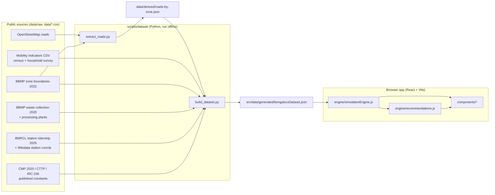

# CityFlow Architecture

CityFlow is a what-if simulator for peak-hour urban pressure in Bengaluru. You change private-vehicle
use, bus service, freight volume or close a major road, and it shows how traffic, freight logistics
and solid-waste handling respond in each of the 8 BBMP zones.

It is a static single-page app: there is no server and no live feed. A Python pipeline turns public
datasets into one JSON file, and a pure JavaScript engine runs the model in the browser.



## Running it

| Command | What it does |
|---|---|
| `npm install && npm run dev` | Start the app at http://localhost:5173 |
| `npm run validate` | Engine checks: calibration, trip conservation, direction of effects, closures |
| `npm run build` | Production bundle in `dist/` |
| `npm run build:data` | Rebuild the dataset JSON from `data/` (needs Python 3 + `pip install -r scripts/dataset/requirements.txt`) |
| `npm run fetch:data` | Re-download every raw source into `data/raw/` |

`build:data` works from a fresh clone because the processed road network
(`data/derived/roads-by-zone.json`) is committed. The raw OpenStreetMap tiles (~75 MB) are gitignored,
so `extract_roads.py` only needs to run again after `fetch:data`.

## Repository layout

```
data/
  bengaluru-mobility-indicators.csv   zone population, jobs, trip rate, trip length, mode share
  raw/                                downloaded sources (OSM tiles gitignored)
  derived/roads-by-zone.json          lane-km and capacity per zone and per corridor
scripts/
  dataset/                            fetch_raw.sh, extract_roads.py, build_dataset.py, zones.py
  validateEngine.js                   engine validation (npm run validate)
src/
  data/generated/bengaluruDataset.json   the dataset (generated; do not hand-edit)
  data/cityData.js                    single import point for the dataset
  data/presetScenarios.js             preset what-if scenarios
  engine/simulationEngine.js          the model (pure functions, no React)
  engine/recommendations.js           rule-based advice from baseline-vs-scenario deltas
  components/                         UI panels
  utils/formatters.js                 number formatting and severity thresholds
```

## Data sources

Every figure in the zone inspector carries a tag: **Measured** means taken directly from a source,
**Derived** means arithmetic on measured inputs, and **Estimated** means it depends on at least one assumption below.

| Input | Source | Year | Status |
|---|---|---|---|
| Zone boundaries (8 zones) | [BBMP Zone Boundaries, OpenCity](https://data.opencity.in/dataset/bbmp-ward-information) | 2022 | Measured |
| Population, jobs, trip rate, trip length, mode share | `data/bengaluru-mobility-indicators.csv` | 2011 census, 2008-era survey | Measured |
| Road length, class and lanes | OpenStreetMap via Overpass | 2026 | Measured (lanes tagged on 62–99% of arterial km; class defaults elsewhere) |
| Per-lane road capacity | IRC:106-1990 capacity guidelines | 1990 | Published standard |
| Vehicle occupancy (car 2.3, 2W 1.5, auto 1.8, bus 37.5) | CMP 2020 household survey | 2020 | Measured |
| BMTC fleet operated (6,143) | CMP 2020 Table 2-7 | 2018 | Measured |
| Observed peak speed (11 km/h private, 8 km/h PT) | CMP 2020 speed and delay survey | 2020 | Measured, used for calibration |
| Goods share of in-city traffic (truck 4.9%, LCV 3.5%) | CTTP (RITES) screenline composition | c. 2010 | Measured |
| Goods vehicles entering the city per day | CMP 2020 Table 2-18 | 2020 | Measured |
| Metro boardings per station | [BMRCL RTI data](https://github.com/Vonter/bmrcl-ridership-hourly), 48 days | Aug–Sep 2025 | Measured |
| Metro station locations | Wikidata | 2026 | Measured (1 of 83 stations, Singayyanapalya, unmatched) |
| Waste collected per zone | [BBMP collections, OpenCity](https://data.opencity.in/dataset/bbmp-solid-waste-management-data) | May 2020 | Measured |
| Waste processing capacity (2,750 TPD) | BBMP processing plant list | c. 2019 | Measured |

## How the dataset is built

`extract_roads.py` clips every OSM road to the zone polygons and computes, per zone and road class,
road-km, lane-km and capacity in PCU-km per hour (length × lanes × IRC:106 per-lane capacity).
It also records the capacity of eight named corridors (ORR, Hosur Road, Bellary Road, Tumkur Road,
Mysore Road, Old Madras Road, Old Airport Road, Bannerghatta Road) in each zone they cross.

`build_dataset.py` then, per zone:

1. **Rescales the CSV onto the 2022 boundaries.** The CSV describes older, differently drawn zones
   (for example, Dasarahalli is 61 km² in the CSV and 29 km² in 2022). Population and jobs are taken as
   density × 2022 area, so demand and road capacity cover the same land.
2. **Projects population to 2025** using each zone's own 2001–2011 growth rate.
3. **Computes daily trips** = population × trip rate, split by mode share. Survey shares sum to
   101–103%, so they are normalised.
4. **Allocates city-level streams**: bus-km (fleet × observed bus speed) by public-transport trips,
   goods vehicles (screenline share) by jobs, freight tonnage (inbound goods vehicles × payload × load
   factor) by jobs and population, and waste processing capacity by population.
5. **Scales waste** from May 2020 collections to 2025 by population growth.
6. **Calibrates** the one free parameter (below) and writes the JSON with a full source and assumption list.

## The model

The engine is `src/engine/simulationEngine.js`: pure functions of `(dataset, scenario)`.
Every pressure index is a **utilisation percentage: 100% means demand equals capacity.**
Severity bands: under 80% is within capacity, 80–100% near capacity, over 100% over capacity.

### Traffic

For each zone, peak-hour road demand in PCU-km/h:

```
resident load  = Σ_modes  trips_m × peakHourFactor / occupancy_m × PCU_m × tripLength
private load   = ½ × resident load  +  ½ × cityResidentLoad × zoneJobsShare     (trip productions + attractions)
total load     = private load + bus PCU-km × transitModifier + goods PCU-km × freightModifier
peak demand    = total load × majorRoadShare × (peakDirectionShare / 0.5)
V/C            = peak demand / (arterial capacity − closed-corridor capacity)
travel time    = 1 + α × (V/C)^β              (BPR-form delay curve)
peak speed     = freeFlowSpeed / travel time
traffic %      = V/C × 100
```

### Calibration

Only **α** is fitted. It is solved so the vehicle-km-weighted city travel-time index equals
40 / 11 = 3.64, where 11 km/h is the CMP 2020 observed average peak speed on major corridors.
Result: α = 2.147, and the baseline city peak speed reproduces 11.0 km/h (checked by `npm run validate`).

### Scenario levers

| Lever | Effect in the model |
|---|---|
| Private vehicle usage | Scales private motorised trips |
| Public transit service | Ridership changes by elasticity 0.5 × service change. Riders gained come from, and riders lost go to, private modes in proportion to their shares. Bus-km on the road scale with service. |
| Delivery / freight volume | Scales goods vehicles, freight tonnage and fleet workload |
| Corridor closure | Removes that corridor's arterial capacity in each zone it crosses; demand does not disappear |

### Logistics and waste

Both fleets are slowed by congestion. Only the driving half of a cycle stretches:

```
cycle factor  = 0.5 + 0.5 × (zone travel time / city baseline travel time)
logistics %   = 75% × freightModifier × cycle factor × 100
waste %       = waste generated / processing capacity share × cycle factor × 100
overall %     = 0.4 × traffic + 0.3 × logistics + 0.3 × waste
```

City-wide figures are weighted by where the load is: traffic by vehicle-km, logistics by freight
tonnage, waste by tonnage. A gridlocked core is not averaged away by empty outskirts.

### Recommendations

`recommendations.js` compares a scenario with the baseline and fires fixed rules (e.g. overall up by
3 points or more, traffic over 100%, a corridor closed). Results are sorted by severity and capped at 5,
so critical advice is never dropped.

## Assumptions

These are the numbers not taken from data. All of them are in `ASSUMPTIONS` in
`scripts/dataset/build_dataset.py` and shown in the app's Data sources panel.

| Assumption | Value | Why |
|---|---|---|
| Peak-hour factor | 10% | Indian metro planning range 8–11% |
| Peak-direction share | 60% | Standard 60:40 directional split |
| Vehicle-km on arterial network | 70% | Collectors and local streets carry trip access legs |
| Free-flow speed | 40 km/h | Urban arterial design speed reduced for signal density |
| Delay-curve exponent β | 2 | Signal-controlled networks; the highway BPR value of 4 over-penalises |
| Trip-end split | 50 / 50 | Trips load both home and work ends |
| Transit service elasticity | 0.5 | TCRP Report 95 |
| Payloads | LCV 2 t, truck 9 t, MAV 20 t | Typical rated payloads |
| Load factor | 0.6 | Includes empty backhauls |
| Freight fleet utilisation at baseline | 75% | No public fleet-capacity data |
| Driving share of a fleet cycle | 50% | Loading, unloading and handling take the rest |
| Local-street lane capacity | 300 PCU/h | Not covered by IRC:106 |
| Composite weights | 0.4 / 0.3 / 0.3 | Policy choice |

## Baseline results (2025)

| Zone | Population | Arterial km | Traffic | Peak speed | Logistics | Waste | Metro boardings/day |
|---|---|---|---|---|---|---|---|
| West | 17,65,110 | 178 | 173% | 5.4 km/h | 114% | 258% | 1,70,977 |
| East | 20,86,640 | 242 | 87% | 15.3 km/h | 65% | 145% | 1,23,188 |
| South | 22,31,897 | 257 | 98% | 13.0 km/h | 69% | 132% | 1,13,468 |
| Yelahanka | 7,13,039 | 174 | 33% | 32.5 km/h | 50% | 112% | 0 |
| Mahadevapura | 12,46,242 | 231 | 53% | 25.0 km/h | 54% | 85% | 1,27,610 |
| Bommanahalli | 6,11,738 | 181 | 27% | 34.7 km/h | 49% | 135% | 39,966 |
| Rajarajeshwari Nagar | 8,11,382 | 246 | 16% | 37.9 km/h | 48% | 90% | 64,649 |
| Dasarahalli | 2,35,491 | 42 | 27% | 34.7 km/h | 49% | 149% | 22,112 |
| **City** | **97,01,539** | | **98%** | **11.0 km/h** | **72%** | **147%** | **7,04,956** |

The waste figure is not a modelling artefact. May 2020 collections were 3,766 t/day against 2,750 t/day
of operational processing capacity; the gap goes to landfill.

## Known limitations

- **Outer IT corridors are under-loaded.** Jobs come from 2011 employment density, before most of the
  growth along Whitefield, ORR and Electronic City. Mahadevapura and Bommanahalli therefore show
  25–35 km/h peak speeds, faster than people there experience. A current employment dataset per zone
  is the single most valuable addition.
- **Zone averages hide hotspots.** The model works per zone, so a jammed Silk Board junction is averaged
  with quiet roads nearby. Link-level assignment would need an origin-destination matrix.
- **Population is projected, not counted.** No census has been held since 2011; zone growth rates from
  2001–2011 are extended to 2025.
- **Only zone residents' trips are counted**, plus goods and buses. Through traffic and commuters from
  outside BBMP are not modelled.
- **Freight and fleet capacities are estimated** from city-boundary counts and assumptions; there is no
  public per-zone freight data.
- **Metro ridership is display-only.** The survey public-transport share predates most of the metro
  network, and folding metro boardings into it would double count.
- **Waste data are from May 2020**, during the COVID-19 lockdown period, when commercial waste was likely lower.

## Extending

- **New or updated source:** add it in `build_dataset.py` (plus a download line in `fetch_raw.sh`), give
  it a `meta.sources` entry, run `npm run build:data`, then `npm run validate`.
- **New assumption:** add it to `ASSUMPTIONS` with a `basis`; it appears in the app automatically.
- **New corridor:** add a name pattern to `CORRIDORS` in `extract_roads.py` and rerun both build steps.
- **New lever:** add a field to `SCENARIO_DEFAULTS` and `sanitizeScenario`, apply it in
  `calculateCitySimulation`, add a control in `SimulatorControls.jsx`, and add a direction check to
  `scripts/validateEngine.js`.
